# MINGGU Ke-2

## JAVASCRIPT Dasar

### Scope and Function
- **Scope**<br />
  Scope adalah konsep dalam flow data variabel. Menentukan suatu variabel bisa diakses pada scope tertentu atau tidak.
  - Blocks <br/>
    Blocks adalah code yang berada didalam curly braces ```{}```. Conditional, function, dan  looping menggunakan blocks.
  - Global Scope <br/>
    Global scope berarti variabel yang kita buat dapat diakses dimanapun dalam suatu file. Agar menjadi Global Scope, suatu variabel harus dideklarasikan diluar Blocks.<br/>
    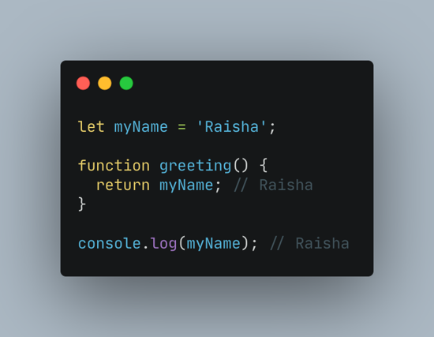
  - Local Scope <br/>
    Local scope berarti kita mendeklarasikan variabel didalam blocks seperti function, conditional, dan looping. Maka variabel hanya bisa diakses didalam blocks saja. Tidak bisa diakses diluar blocks.
    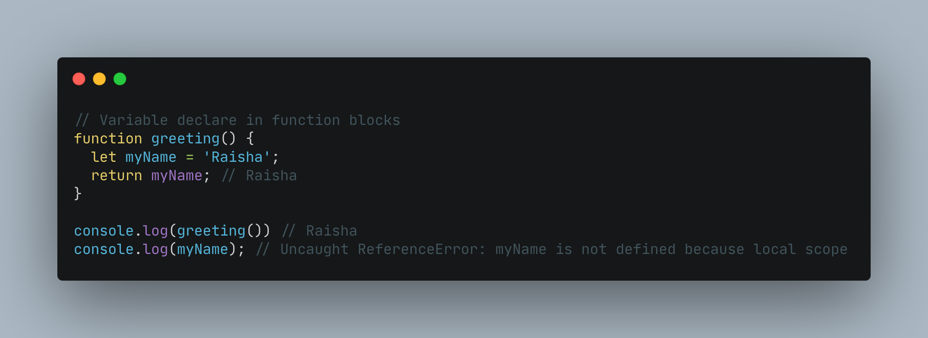
- **Function**<br />
  Function adalah sebuah blok kode dalam sebuah grup untuk menyelesaikan 1 task/1 fitur.
  - Membuat Function<br/>
    Contoh format penulisan function:

        ```
        <script>
 
        /membuat function di javascript
        function nama_function(){
        // isi function nya di buat di sini
        }
 
        </script>
        ```
    Untuk membuat function, penulisannya harus di awalai oleh syntax "function" dan kemudian di lanjutkan dengan nama function yang akan dibuat. Dan isi dari function dituliskan di dalam tanda kurung kurawal pembuka "{" dan tanda kkurung kurawal penutup "}"
  - Memanggil Function<br/>
    Dalam JavaScript, Function dapat berperan sebagai sebuah Object, dimana memiliki method dan property, seperti Function.arguments, Function.length, Function.call() atau Function.apply(). <br/>
    Ada 4 cara memanggilan fuction, yaitu: dipanggil sebagai function biasa, dipanggil sebagai method, dipanggil sebagai function constructor dan dipanggil dengan method function (Call dan Apply).
    1. Function dipanggil sebagai function biasa<br/>
       Pemanggilan ini adalah memanggil sebuah function pada umumnya, dengan menyebut nama functionnya.<br/>
       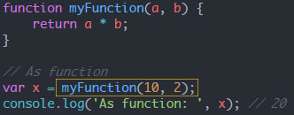
    2. Function dipanggil sebagai method<br/>
       JavaScript adalah bahasa yang sangat fleksibel, kita bisa menyimpan function dalam variable atau object. Untuk memanggil function dalam sebuah object (sebagai method), caranya seperti di bawah ini.<br/>
       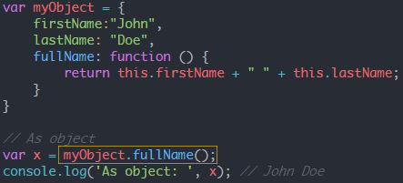
    3. Function dipanggil sebagai constructor<br/>
       Dalam konsep Object, constructor adalah sebuah method yang paling pertama dan akan selalu dijalankan saat object dipanggil. Sebuah function dapat dipanggil layaknya sebuah constructor.<br/>
       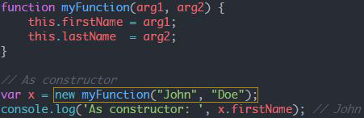
    4. Function dipanggil disertai method function (Call, Apply atau Bind)<br/>
       Call, Apply dan Bind adalah beberapa method yang dimiliki oleh function, yang berfungsi untuk memanggil sebuah function disertai argument, argument pertama adalah nama object yang akan diikat dan argument kedua dan seterusnya adalah data yang dimasukan ke dalam function.<br/>
       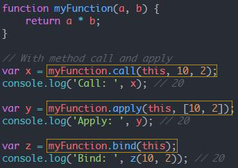
  - Parameter dan Argument <br/>
    Dengan parameter, function dapat menerima sebuah inputan data dan menggunakannya untuk melakukan task/tugas. Saat membuat function/fitur, kita harus tahu data-data yang dibutuhkan. Misalnya saat membuat function penambahan 2 buah nilai. Data yang dibutuhkan adalah 2 buah nilai tersebut.<br/>
    
    Argumen adalah nilai yang digunakan saat memanggil function. Jumlah argumen harus sama dengan jumlah parameternya Jadi jika di function penambahan ada 2 parameter nilai saat membuat function. Saat memanggil function kita gunakan 2 buah nilai argumen.<br/>
    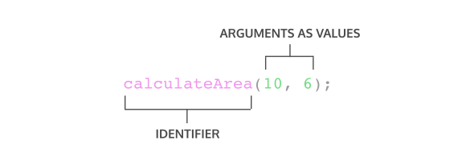
  - Default Parameter<br/>
    Default paramaters digunakan untuk memberikan nilai awal/default pada parameter function. Default parameters bisa digunakan jika kita ingin menjaga function agar tidak error saat dipanggil tanpa argumen. <br/>
    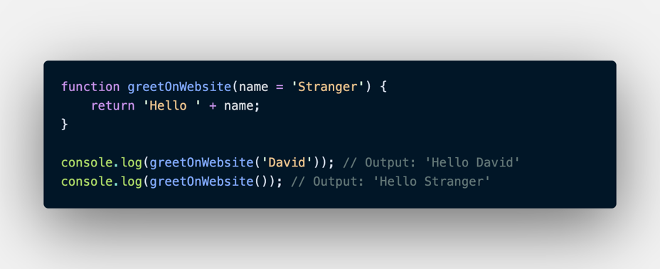
  - Function Helper<br/>
    Kita bisa menggunakan function yang sudah dibuat pada function lain.<br/>
    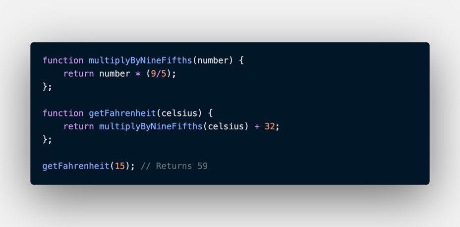
  - Arrow Function<br/>
    Arrow function adalah cara lain menuliskan function. Ini adalah fitur terbaru yang ada pada ES6 (Javascript Version).<br/>
    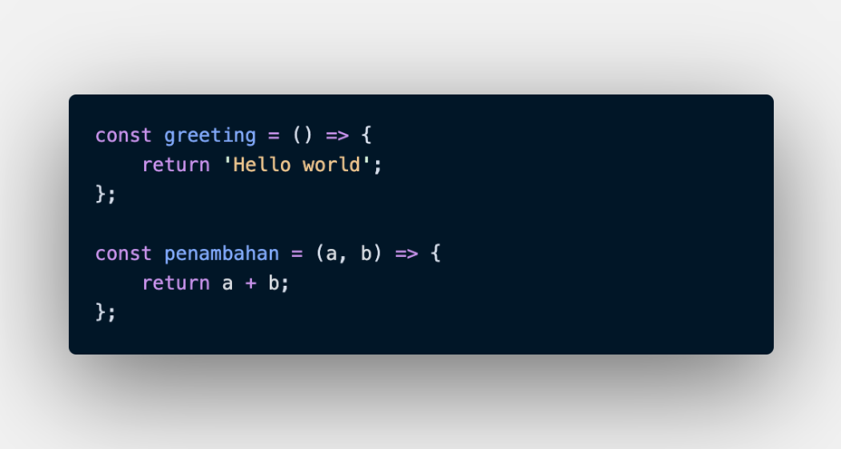
  - Short Syntax Function<br/>
    - Zero Parameters<br/>
      ```
      const functionName = () => {};
      ```
    - One Parameters<br/>
      ```
      const functionName = paramOne => {};
      ```
    - Two or More Parameters<br/>
      ```
      const functionName = (paramOne, paramTwo) => {};
      ```
    - Single-Line Block<br/>
      ```
      const sumNumbers = number => number + number;
      ```
    - Multi-Line Block<br/>
      ```
      const sumNumbers = number => {
        const sum = number + number;
        return sum;
      };
      ```

### Data Type Built in Prototype & Method
Tipe data adalah klasifikasi yang kita berikan untuk berbagai macam data yang digunakan dalam programming.
Terdapat tipe data primitive dan non primitive seperti:
- Tipe Data Primitive<br/>
  Tipe data primitif hanya dapat menyimpan satu nilai pada satu waktu dan tidak dapat diubah menggunakan cara yang sama seperti tipe data non-primitif. Tipe data Primitif akan dianggap sama jika nilainya sama
  - String
  - Number
  - BigInt
  - Boolean
  - undefined
  - null
  - Symbol
- Tipe Data Non Primitive<br/>
  Tipe data non-primitif dapat menyimpan lebih dari satu nilai pada satu waktu dan dapat diubah. Tipe data non-primitif akan dianggap berbeda meskipun nilainya sama dan dalam urutan yang sama.
  - Object 
  - Array
  - Function

Built in Prototype and Method<br/>
Built in adalah sebuah properti method yang digunakan untuk  menyelesaikan sebuah nilai. <br/>
Method JavaScript adalah tindakan yang dapat dilakukan pada objek. Method adalah fungsi yang disimpan sebagai properti objek.<br/>
Terdapat beberapa penggunaan Method:
1. Melakukan pengecekan tipe data yang digunakan<br/>
        
        let nama = "Julia"
        console.log(typeof nama) // string
2. Melakukan perubahan huruf menjadi huruf besar

        console.log(nama.toUpperCase())
2. Melakukan perubahan huruf menjadi huruf kecil

        console.log(nama.toLowerCase())
2. Melakukan pengembalikan karakter sesuai index yang sudah di tentukan

        console.log(nama.charAt(2))
2. Melakukan perubahan huruf menjadi huruf besar

        console.log(nama.toUpperCase())
2. Melakukan pencarian sebuah kata atau karakter pada sebuah string

        console.log(nama.includes("s")) // true

### DOM (Document Object Model)
DOM adalah objek model standar dari XML dan HTML yang memiliki sifat platform secara mandiri.
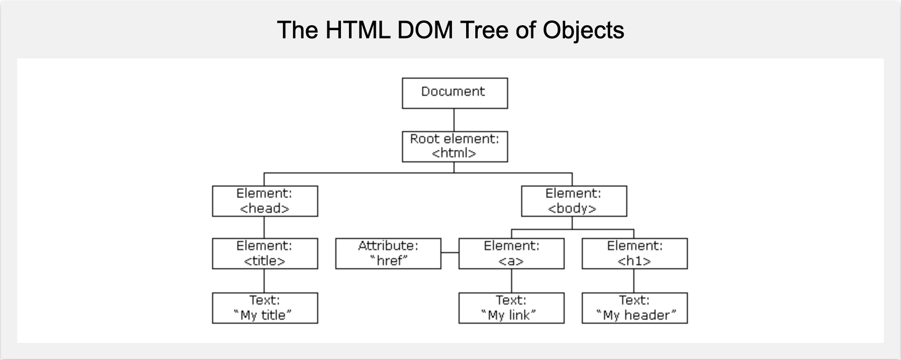
Cara akses DOM:
- Mengakses DOM dengan traversing
    - Traversing ke bawah
        - getElementById(id)
        - getElementsByTagName(tag)
        - getElementsByClassName(className)
        - querySelectorAll(cssSelector)
    - Traversing ke atas
        - parent element
                
                console.log(itemQuery.parentElement);
        - closest
                
                console.log(itemQuery.closest(".list"));
    - Traversing ke samping

            console.log(itemQuery.nextElementSibling);
            console.log(itemQuery.previousElementSibling);

### Manipulation DOM
DOM untuk manipulasi seperti menambah element di HTMl, create element, append ke sebuah element, remove, dsb.
- Element.innerHTML, untuk mengubah konten HTML di dalam sebuah element.
- Element .createElement(), untuk membuat elemen.
- Element.append, untuk menambahkan element ke dalam parents baik berupa object node maupun DOM String.
- Element.appendChild, untuk menambahkan element ke dalam parents baik berupa object node tetapi tidak bisa menggunakan DOM String.
- Remove(), untuk menghapus elemen (atau node) dari dokumen
- link. attribute, untuk melihat dan mengecek attribute apa yang pada file html.
- SetAttribute, untuk menambahkan attribute
- link.style, untuk memberikan styling pada file html dengan DOM.
- link.style.removeProperty(), untuk menghapus style properti.
- Mendapatkan style dari element
- List of class, Menambahkan class, Menghapus class

### Event DOM
Salah satu kegunaan dari DOM adalah untuk berinteraksi dengan HTML Event di suatu website. Pernahkan ketika kita klik 1 tombol di satu website, terkadang akan muncul popup window yang menyampaikan suatu pesan. Salah satu cara untuk melakukan itu adalah dengan menggunakan DOM Event.<br/>
Ada banyak sekali tipe HTML Event di JavaScript. Kali ini kita hanya akan membahas onclick yaitu HTML Event yang akan terjadi ketika user klik suatu element HTML.<br/>
Syntax nya :
```
onclick = kodeJavaScript
```
Jenis - Jenis event DOM:
- Click
- Scroll
- Change
- Focus
- Hover
- Submit
- Blur
Cara menambahkan event pada html
- HTML atribute

        <h2 onclick="alert"('Memory Full')>Memori Penuh, Silahkan kosongkan ruangan</h2>
- eventproperty

        h1.onclick = function(){
            alert("Ini adalah Heading")
        }
- addeventlistener()

        let button = document.getElementById("btn")
        button.addEventListener("click", function(){
            alert("ini adalah paragraf")
        })

