# MINGGU Ke-3

## JAVASCRIPT Intermediate

### Array
Array adalah tipe data list order yang dapat menyimpan tipe data apapun di dalamnya. Array dapat menyimpan tipe data String, Number, Boolean, dan lainnya. 
Contoh Array  
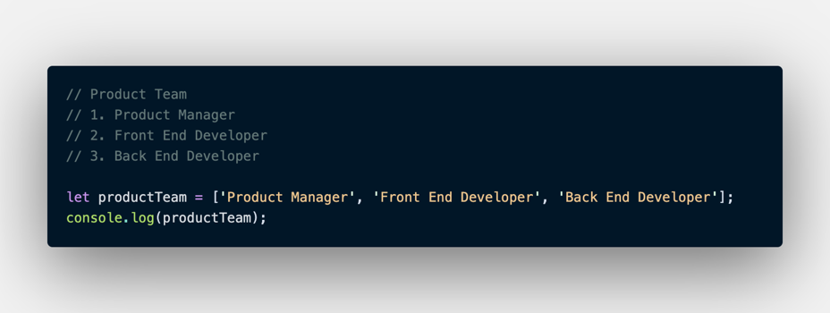 
Atau bisa dengan menuliskan kode seperti berikut:

    let toDoList = [
        'Belajar Javascript',
        'Mencuci Baju',
        'Latihan membuat aplikasi javascript'
    ];
    console.log(toDoList);

- Membuat Array 
  Array didefinisikan menggunakan square brackets.

        // Square Bracket
        []
- Mengakses/Memanggil Array 
  Array pada javascript dihitung dari index data ke-0. Data pertama adalah index ke-0. 
  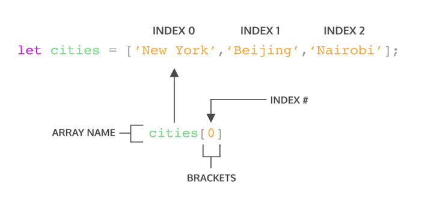
- Update Array 
  Seperti tipe data dan variabel pada umumnya, kita dapat mengupdate data pada Array 
  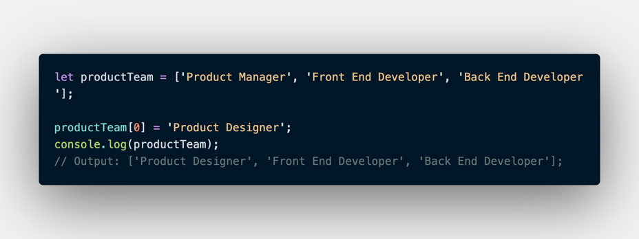
- Const Pada Array 
  Jika menggunakan let, kita dapat mengubah array  dengan array baru dan konten nilai yang ada di dalam array dengan nilai lain. Const tidak bisa melakukan update data. Namun pada Array kita dapat melakukan update konten nilai di dalam array (mutable). Yang tidak bisa adalah mengubah array dengan array yang baru jika menggunakan const. 
  [array4](array4.png)
- Array Properties 
  Array memiliki 5 properti yang sering digunakan yaitu constructor, length, index, input, dan prototype. 
  Properties adalah fitur yang sudah disediakan oleh Javascript untuk memudahkan developer.
  - .length 
    length akan mengembalikan nilai dari jumlah panjang data suatu array.

        let productTeam = ['Product Manager', 'Front End Developer', Back End Developer'];
        console.log(productTeam.length);
        // output: 3
  - Array Method   
    Array memiliki method atau biasa disebut built-in methods. Artinya Javascript sudah memudahkan kita dengan menyediakan function/method umum yang bisa kita gunakan.
    - .push() 
      .push() adalah method untuk menambahkan item  array pada urutan yang paling akhir.

        let toDoList = [
            'Belajar Javascript',
            'Mencuci Baju',
            'Latihan membuat aplikasi javascript'
        ];
        toDoList.push('Mengikuti kelas Online Programming');
        console.log(toDoList);

        // Output : [
        //    'Belajar Javascript',
        //    'Mencuci Baju',
        //    'Latihan membuat aplikasi javascript',
        //    'Mengikuti kelas Online Programming'
        // ];
    - .pop() 
      .pop() adalah method yang menghapus item array index terakhir. 
      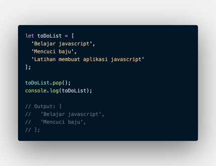
    - .shift() 
      .shift() adalah method untuk menghapus item Array pada index pertama. 
      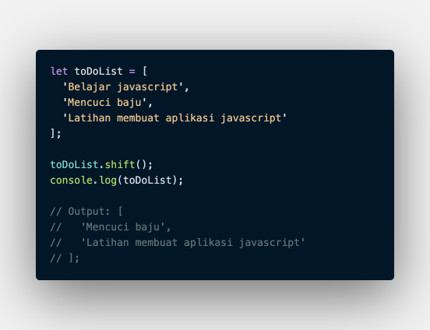
    - .unshift() 
      .unshift() adalah method untuk menambahkan item Array pada index pertama. 
      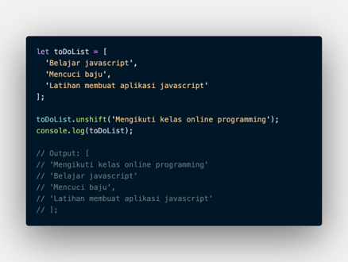
    - .sort() 
      .sort() adalah method untuk mengurutkan secara Ascending atau Descending Alphanumeric.

            const numbers = [1, 5, 6, 7, 4];
            numbers.sort();
            console.log(numbers);
            // Ouptut :[1, 4, 5, 6, 7]
- Looping pada Array 
  Array memiliki built in methods untuk melakukan looping yaitu .map() dan .forEach()
  - .forEach() 
    .forEach() adalah method untuk melakukan looping pada setiap elemen array. 
    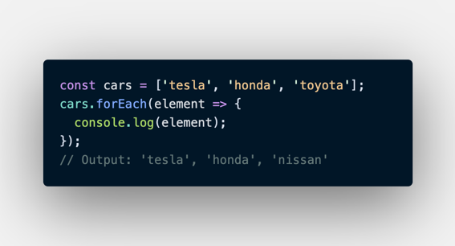
  - .map() 
    .map() melakukan perulangan/looping dengan membuat array baru. 
    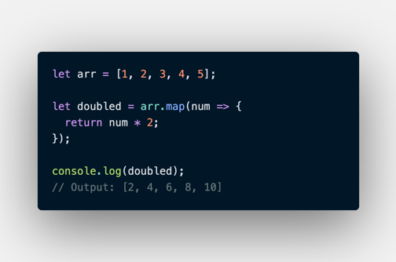
  
  Bahwa .map() dan forEach() sama-sama melakukan looping dan mengembalikan nilai baru dari operasi yang dilakukan. Perbedaannya adalah .forEach tidak dapat membuat Array baru dari hasil operasi yang ada dalam looping. Lalu dari segi performance juga sangat jauh. 
  Gunakan **.forEach()** jika hanya memerlukan looping untuk menampilkan saja atau menyimpan ke database. 
  Gunakan **.map()** jika akan melakukan operasi pada array seperti yang dapat mengubah nilai array sebelumnya.

### Multidimensional Array
Multidimensional Array bisa dianalogikan dengan array of array. Ada array didalam array.
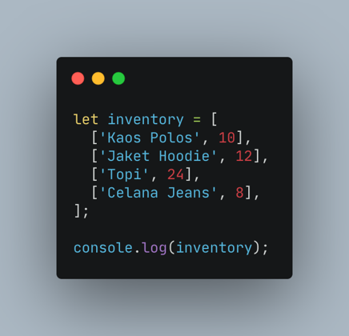 
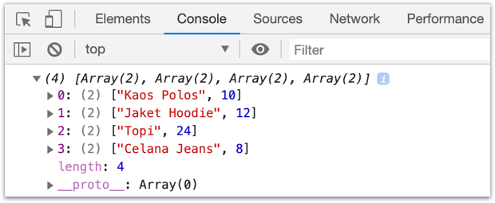
- Akses index multidimensional Array 
  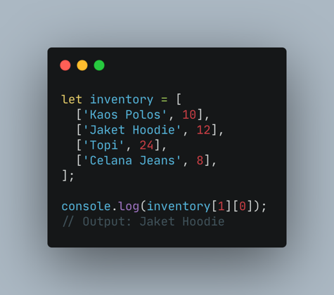 
  Sama seperti array satu dimensi, multidimensional array juga dapat menggunakan Property dan Method built-in Array.
- Operation using map in multidimensional array 
  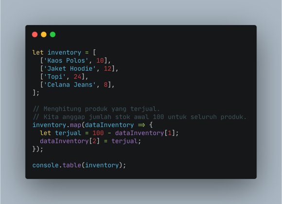 
  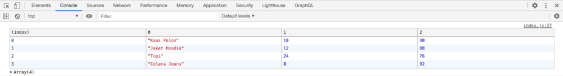
- Looping for multidimensional Array 
  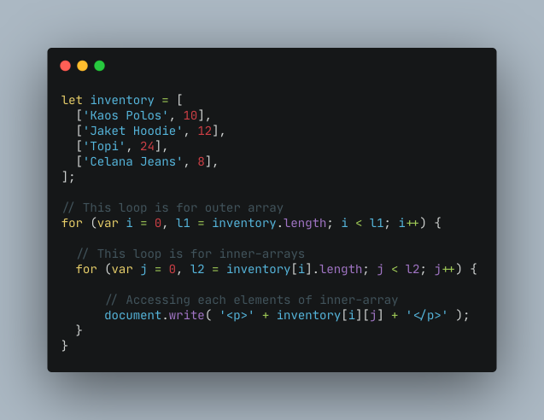 
  

### Object
Object adalah sebuah tipe data pada variabel yang menyimpan properti dan fungsi (method). Properti adalah data lengkap dari sebuah object. Method adalah action dari sebuah object. Apa saja yang dapat dilakukan dari suatu object.
- Membuat sebuah objek  
  Object dapat diassign kedalam sebuah variabel.

        let person = {}
  Sama seperti array, didalam object kita dapat menyimpan properti dengan tipe data apapun.
  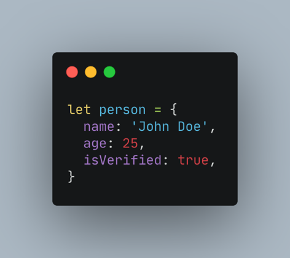
- Mengakses Object dan Property Objek
  - Mengakses seluruh object 

        let person = {
            name: 'Julia',
            age: 21,
            isVerified: true
        }

        console.log(person);
  - Mengakses Properti Objek 
    
        let person = {
            name: 'Julia',
            age: 21,
            isVerified: true
        }

        console.log(person.name); // 'Julia'
  - Bracket Notation 
    
        let person = {
            name: 'Julia',
            age: 21,
            'current address': 'Bandung, Indonesia'
        }

        console.log(person['name']); // 'Julia'
        console.log(person['current address']); // 'Bandung, Indonesia'
- Update Object 
  Object dapat mengupdate value dari key yang sudah tersedia. Object dapat menambahkan key dan value baru. 
  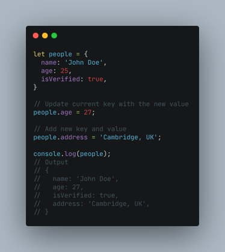 
  Jika menggunakan constant pada variable object. Kita tidak bisa mengganti seluruh data object dengan object yang baru. 
  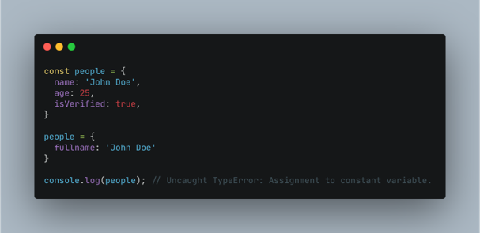 
  Jadi jika membutuhkan untuk update seluruh data object gunakan ‘let’ pada saat deklarasi variabel.
  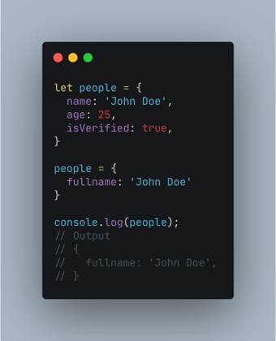
- Delete Object Property 
  Menghapus properti dari object menggunakan delete operator. 

    let person = {
            name: 'Julia';
            age: 21;
            isVerified: true;
    }

    delete person.age;

    console.log(person);
- Method  
  Jika value yang kita masukkan pada property berupa function. Maka itu disebut method. 
  console adalah global javascript object. log() adalah property yang berupa function dari object console. Sehingga kita memanggila dengan cara console.log(). 
  Kita bisa membuat method custom untuk kita gunakan pada aplikasi kita loh.
  Kita akan membuat method untuk greeting pada aplikasi ecommerce misalnya.

        const greeting = {
            welcome: function(){
                return 'Halo selamat datang';
            },
            afterTransaction: function(){
                return 'Terima kasih sudah membeli produk kami';
            },
        };

        console.log(greeting.welcome()); // 'Halo selamat datang'
- Nested Objek 
  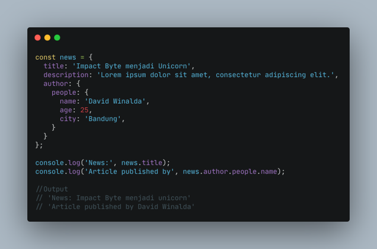
- Passed by reference 
  Passed by reference adalah mengubah data yang ada pada object melalui sebuah function dan memasukkan object sebagai parameter function. 
  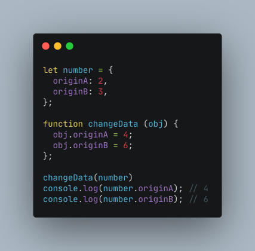
- Looping Object 
  
        for(let key in object){
            // ...
        };
    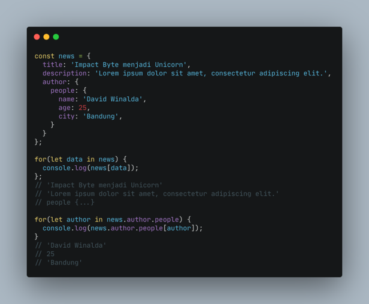
- Array of Object 
  Object sama seperti Array yang bisa menyimpan banyak data.Kita dapat menggunakan array of object untuk data yang lebih dari satu.

        let students = [
            {
                name: 'Julia',
                age: 21,
                isVerified: true,
            },
            {
                name: 'Puput',
                age: 21,
                isVerified: false,
            },
            {
                name: 'Nadlyne',
                age: 18,
                isVerified: true,
            }
        ];

        students.forEach((listStudent) => {
            console.log(listStudent);
        })
  Hasil dari console log akan seperti ini:  
  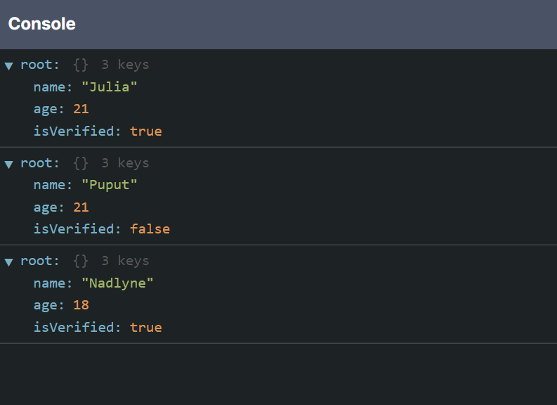

### Recursive
Recursive adalah function yang memanggil dirinya sendiri sampai kondisi tertentu. 
Struktur Recursive

    function recursive(){
        // ...
        recursive();
        // ...
    }
Recursive akan berhenti memanggil dirinya sendiri jika kondisi terpenuhi, seperti berikut

    funstion recursive(){
        if(condition){

        } else{
            recursive();
        }
    }
Ciri - Ciri Rekursif : 
- Fungsi rekursif selalu memiliki kondisi yang menyatakan kapan fungsi tersebut berhenti. Kondisi ini harus dapat dibuktikan akan tercapai, karena jika tidak tercapai maka kita tidak dapat membuktikan bahwa fungsi akan berhenti, yang berarti algoritma kita tidak benar.
- Fungsi rekursif selalu memanggil dirinya sendiri sambil mengurangi atau memecahkan data masukan setiap panggilannya. Hal ini penting diingat, karena tujuan utama dari rekursif ialah memecahkan masalah dengan mengurangi masalah tersebut menjadi masalah-masalah kecil.

Contoh kasus recursive: 
Fungsi rekursif menghitung mundur number

    function countDown(fromNumber){
        console.log(fromNumber);

        let nextNumber = fromNumber - 1;

        if(nextNumber > 0){
            countDown(nextNumber);
        }
    }
    countDown(3);

### Asynchronus
Asynchronous yang biasa dikenal juga dengan sebutan non-blocking mengizinkan komputer kita untuk memproses perintah lain sambil menunggu suatu proses lain yang sedang berlangsung. Ini artinya kita bisa melakukan lebih dari 1 proses sekaligus (multi-thread). Eksekusi perintah dengan asynchronous tidak akan melakukan blocking atau menunggu perintah sebelumnya selesai. 
- Menjalankan Asynchronous pada JavaScript:
  - setTimeout(function, milliseconds) digunakan untuk simulasi pemanggilan kembali proses asynchronous yang sedang/sudah selesai dijalankan. Pemanggilan hanya dilakukan 1 kali.

        setTimeout(() => {
        console.log("Cuci baju"); // proses asynchronous
        }, 1000);
        console.log("Menyapu");
        console.log("Mengepel");
        console.log("Memasak");

        // 1000 ms = 1 second

        // Output:
        // Menyapu
        // Mengepel
        // Memasak
        // Cuci baju
  - setInterval(function, milliseconds) digunakan untuk simulasi pemanggilan proses asynchronous yang sedang/sudah dijalankan dalam interval waktu tertentu. Pemanggilan dilakukan berkali-kali sesuai interval waktu yang ditentukan.

        setInterval(() => {
        console.log("Cuci baju"); // proses asynchronous
        }, 3000);
        console.log("Menyapu");
        console.log("Mengepel");
        console.log("Memasak");

        // 3000 ms = 3 second

        // Output:
        // Menyapu
        // Mengepel
        // Memasak
        // Cuci baju (x time)

        // Cuci baju akan dijalankan setiap 3 detik sekali
- Menerapkan Asynchronous pada Aplikasi JavaScript 
  - Callback 
    Callback adalah sebuah function, namun bedanya dengan function pada umumnya adalah pada cara eksekusinya. Jika function pada umumnya dieksekusi secara langsung, sedangkan callback dieksekusi di dalam function lain melalui parameter.
    - Menggunakan Callback
      
            function proses1() {
            console.log("proses 1 selesai dijalankan");
            }

            function proses2(callback) {
            setTimeout(function () {
                console.log("proses 2 selesai dijalankan");
                callback();
            }, 100);
            }

            function proses3() {
            console.log("proses 3 selesai dijalankan");
            }
            proses1();
            proses2(proses3);

            /*
            Hasil Output
            proses1 selesai dijalankan
            proses2 selesai dijalankan
            proses3 selesai dijalankan
            */
    - Membuat callback function
      
            function introduction(firstName, lastName, callback) {
            const fullName = `${firstName} ${lastName}`;

            callback(fullName);
            }

            introduction("Miftah", "Faris", greeting); // Halo Miftah Faris, selamat datang di Skilvul !
  - Promises 
    Promise adalah Sebuah mekanisme baru pada fitur javascript / ES6 yang merepresentasikan sebuah object request pengolahan data yang dilakukan secara asynchronous seperti ajax, dan promise ini mewakili sebuah operasi yang belum selesai, tetapi diharapkan di masa mendatang. 

        let newPromise = new Promise((resolve, reject) => {
        if (true) {
            // apa yang dilakukan jika promise fulfilled
            resolve("Berhasil");
        } else {
            // apa yang dilakukan jika promise rejected
            reject("Gagal");
        }
        });
    - resolve(), jika proses berhasil atau fullfilled.
    - reject(), jika proses gagal atau rejected.

    3 Status promise di javascript:
    - **pending**, jika data sedang diproses.- **fulfilled**, jika data telah berhasil didapatkan.

            const condition = true;

            let newPromise = new Promise((resolve, reject) => {
            if (condition) {
                // apa yang dilakukan jika promise 'fulfilled'
                resolve("Berhasil");
            } else {
                // apa yang dilakukan jika promise 'rejected'
                reject(new Error("Error Gagal"));
            }
            });

            newPromise.then((result) => {
            return result;
            })
            .then((result2) => {
            console.log(result2 + "!!"); // Output: Berhasil!!
            });
    - **rejected**, jika data gagal didapatkan.

            const condition = true;

            let newPromise = new Promise((resolve, reject) => {
            if (condition) {
                // apa yang dilakukan jika promise 'fulfilled'
                resolve("Berhasil");
            } else {
                // apa yang dilakukan jika promise 'rejected'
                reject(new Error("Error Gagal"));
            }
            });

            newPromise
            .then((result) => {
                console.log(result); // Output: Berhasil
            })
            .catch((error) => {
                console.log(error);
            })
            .finally(() => {
                console.log(
                "Finally tetap terpanggil dalam kondisi fulfilled ataupun rejected"
                ); // Output: Finally tetap terpanggil dalam kondisi fulfilled ataupun rejected
            });
  - Async / Await 
    Async/Await merupakan sebuah syntax khusus yang digunakan untuk bekerja dengan Promise agar lebih nyaman dan mudah untuk digunakan. Async/Await terbagi menjadi Async dan Await. 
    Async sendiri merupakan sebuah fungsi yang mengembalikan sebuah Promise. Await sendiri merupakan fungsi yang hanya berjalan di dalam Async.
    - Async 
      
            // async menggunakan keyword function 
            async function tesAsyncAwait() {
            return "Fulfilled";
            }

            console.log(tesAsyncAwait());
            // async menggunakan arrow function
            const tesAsyncAwait = async () => {
            return "Fulfilled";
            };

            console.log(tesAsyncAwait());
      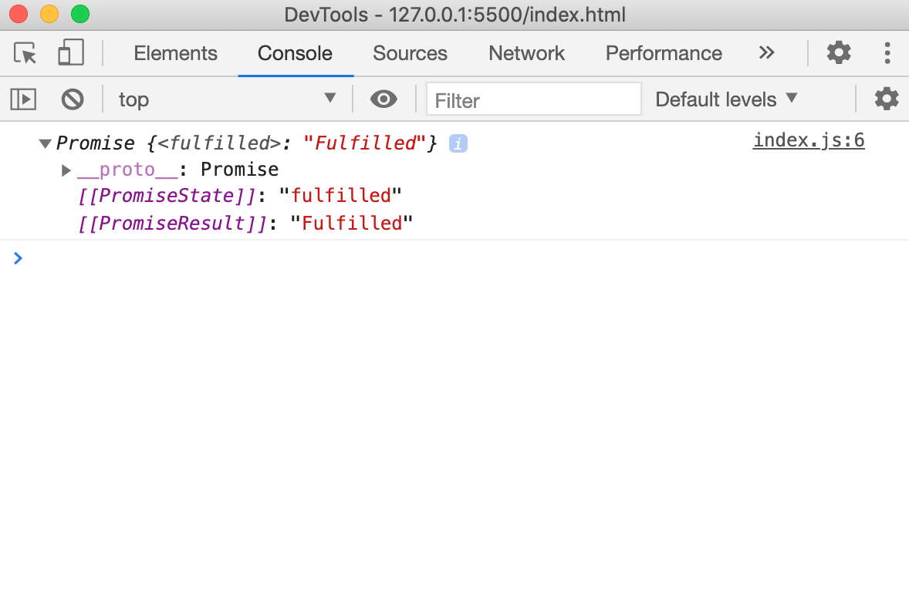
    - Await 
      
            // Definisikan dahulu promise yang ingin digunakan
        let condition = true;
        let tesAsyncAwait = async (condition) => {
        if (condition) {
            return "Condition is fulfilled!";
        } else {
            throw "Condition is rejected!";
        }
        };

        // Membuat fungsi run menjadi asynchronous menggunakan async/await
        const run = async (condition) => {
        try {
            const message = await tesAsyncAwait(condition);
            console.log(message);  // Output: Condition is fulfilled!
            console.log("After condition is fulfilled"); // Output: After condition is fulfilled
        } catch (error) {
            console.log(error);
        }
        };

        run(true);
      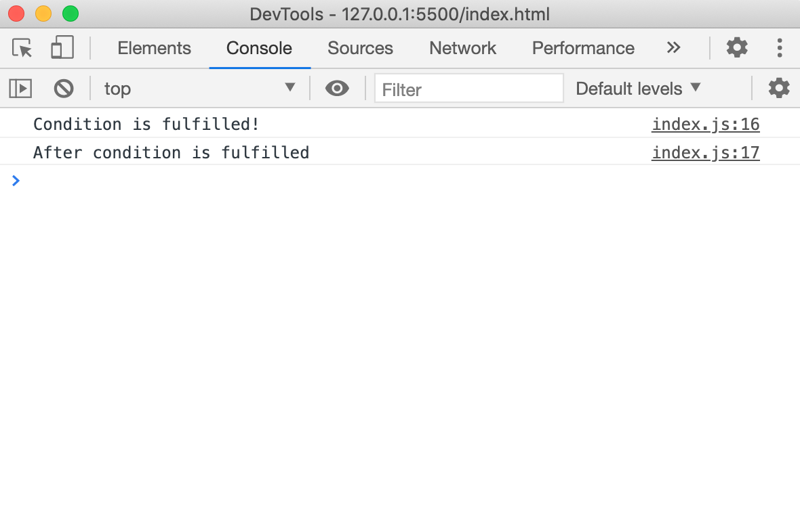
  - Fetch 
    Fetch adalah native web API untuk melakukan HTTP calls dari external network.
    - Fetch dengan Promise
      
            fetch("https://jsonplaceholder.typicode.com/posts")
            .then(function (response) {
                return response.json();
            })
            .then(function (post) {
                console.log(post);
            });
      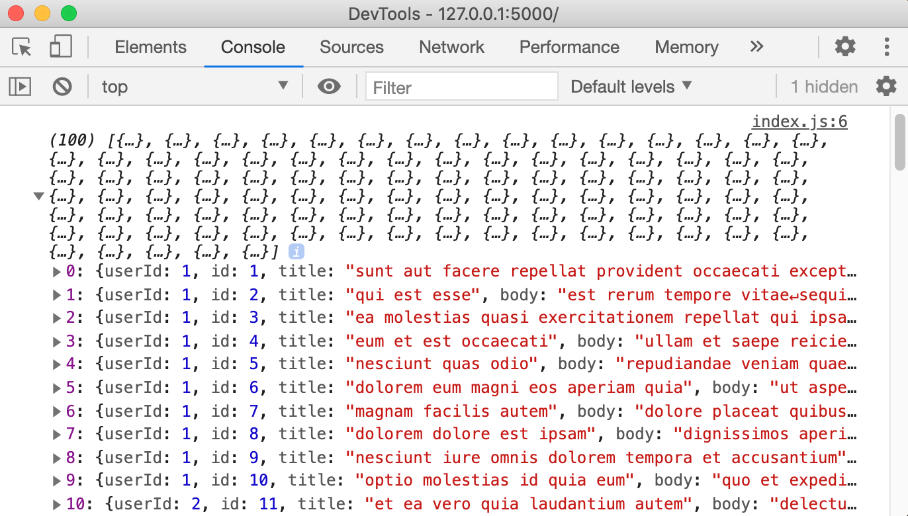
    - Fetch dengan Async/Await
      
            const tesFetchAsync = async () => {
            let response = await fetch("https://jsonplaceholder.typicode.com/posts");
            response = await response.json();
            console.log(response);
            };
            tesFetchAsync();
      

### Web Storage
Web Storage digunakan untuk menyimpan data pengguna seperti pencarian, artikel berita, dan lain-lain ke lokal (browser) menggunakan cookies, local storage, dan session storage.
- Cookies 
  Cookies adalah data kecil yang dikirim dari situs web dan disimpan di komputer kita oleh web browser saat kita menjelajah. Disebut data kecil karena maksimum data yang dapat disimpan dalam cookies adalah 4096 bytes (4 KB). 
  Kekurangan cookies:
  - Setiap kita mengakses situs web, cookies juga kembali dikirim sehingga memperlambat aplikasi web kamu dengan mengirimkan data yang sama.
  - Cookies disertakan pada setiap HTTP request, sehingga mengirimkan data yang tidak dienkripsi melalui internet, maka saat kita ingin menyimpan data dalam cookies kita harus mengenkripsinya terlebih dahulu.
  - Cookies hanya dapat menyimpan data sebanyak 4KB.
  - Lalu cookies juga memiliki tanggal kadaluarsa. Tanggal ini telah ditentukan sehingga web browser bisa menghapus cookies jika tanggal sudah kadaluarsa atau tidak dibutuhkan.
- Local Storage 
  Local storage memiliki karakteristik sebagai berikut:
  1. Menyimpan data tanpa tanggal kadaluarsa.
  1. Data tidak akan dihapus ketika web browser ditutup dan akan tersedia seterusnya selama kita tidak menghapus data local storage pada web browser.
  1. Dapat menyimpan data hingga 5MB.
  1. Hanya dapat menyimpan data string.

  - Menyimpan Data 
    Untuk menyimpan data pada local storage, kita menggunakan method setItem() yang membutuhkan 2 parameter. Parameter pertama adalah key yang ingin kita simpan dan parameter kedua adalah data (value) dari key yang akan disimpan.

        localStorage.setItem('key', value);
  - Mengambil Data 
    Untuk mengambil data yang telah tersimpan pada local storage, kita dapat menggunakan method getItem() yang membutuhkan 1 parameter. Parameter tersebut adalah key dari data yang kita inginkan.

        localStorage.getItem('key');
  - Menghapus Data 
    Untuk menghapus data yang telah tersimpan pada local storage, kita dapat menggunakan method removeItem() yang membutuhkan 1 parameter. Parameter tersebut adalah key dari data yang ingin kita hapus.

        // menghapus key tertentu
        localStorage.removeItem("key");

        // menghapus semua key
        localStorage.clear();
- Session Storage 
  Session storage mempunyai beberapa karakteristik, yaitu:
  1. Data yang disimpan pada session storage akan terus tersimpan selama browser terbuka dan tidak hilang jika laman di-reload.
  1. Membuka banyak tab/window dengan URL yang sama, akan menciptakan session storage yang berbeda di masing-masing tab/window.
  1. Menutup tab/window akan mengakhiri session dan menghapus data yang tersimpan di session storage pada tab/window tersebut.
  1. Data yang tersimpan dalam session storage harus berbentuk string.
  1. Hanya dapat menyimpan data sebanyak 5MB.

  - Menyimpan Data 
    Sama dengan local storage, sintaks untuk menyimpan data pada session storage adalah sebagai berikut:

        // menambah session storage
        sessionStorage.setItem('key', value);
  - Mengambil Data 
    Sama seperti local storage, cara mendapatkan data dari session storage juga menggunakan getItem(), seperti berikut ini:
    
        // mendapatkan session storage
        sessionStorage.getItem('key');
  - Menghapus Data 
    Syntax untuk menghapus data dari session storage ada 2, yaitu:

        // menghapus session storage satu persatu berdasarkan key
        sessionStorage.removeItem('key');

        // menghapus seluruh session storage sekaligus
        sessionStorage.clear();

  
      

