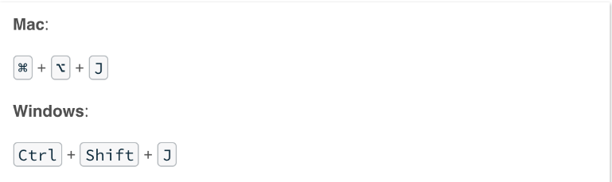
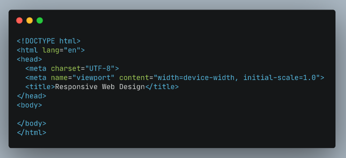
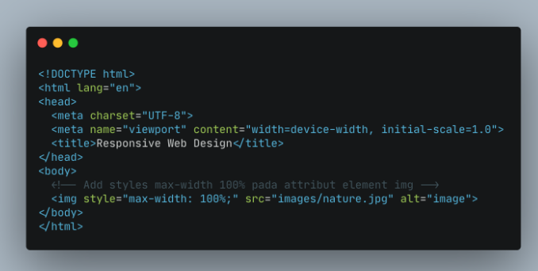
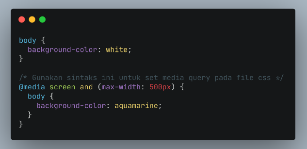
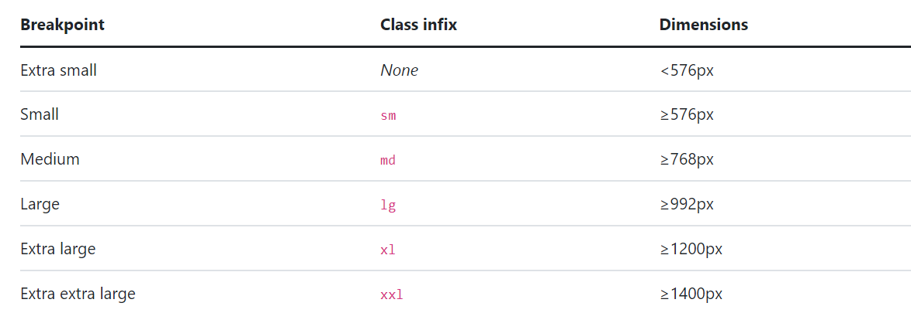
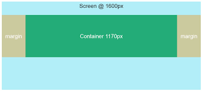
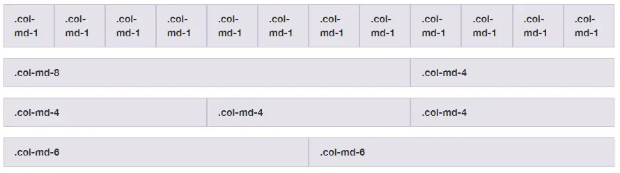

# MINGGU Ke-3

## JAVASCRIPT Intermediate

### Async/Await
Async/Await merupakan sebuah syntax khusus yang digunakan untuk bekerja dengan Promise agar lebih nyaman dan mudah untuk digunakan. Async/Await terbagi menjadi Async dan Await.<br/>
Async sendiri merupakan sebuah fungsi yang mengembalikan sebuah Promise. Await sendiri merupakan fungsi yang hanya berjalan di dalam Async. Await bertujuan untuk menunda jalannya Async hingga proses dari Await tersebut berhasil dieksekusi.

    async function  myAsync () {
        let p = new Promise((resolve, reject) =>    {
            setTimeout(() => resolve("Hello World!"), 2000)
        });

        let result = await p;
        alert(result);
    }

    myAsync();

### Fetch
Fetch merupakan cara baru dalam melakukan network request. Pada dasarnya fungsi fetch memanfaatkan sebuah Promise, sehingga untuk menggunakan nya pastikan browser sudah mendukung ECMAScript 6 atau biasa disebut ES6.<br/>
Untuk menggunakan fetch, cukup gunakan keyword fetch() kemudian tuliskan URL yang akan dituju di dalam tanda kurung tersebut.

    fetch('<URL-to-the-resource-that-is-being-requested>');

Karena fetch mengembalikan sebuah Promise, maka untuk response handling nya kita gunakan fungsi then (jika Promise tersebut mengembalikan resolve) dan catch (jika Promise tersebut mengembalikan reject).

    fetch('<URL-to-the-resource-that-is-being-requested>')
        .then(function (response) {
            return response.json()
        })
        .catch(function (err) {
            console.log(`Ups, ${err} :(`)
        })
Dari kode diatas dapat disimpulkan seperti ini. Jika request pada fetch berhasil dilakukan, maka blok then akan terpanggil dan mengembalikan nilai objek sesuai response yang didapat. Apabila fungsi fetch gagal dilakukan, maka blok catch akan terpanggil dan menampilkan eror pada console.

## Git & Github Lanjutan
- git clone<br/>
  Perintah yang digunakan untuk membuat salinan repository lokal.

        git clone <url repository>
- git branch<br/>
  Sebuah perintah agar bisa melihat seluruh branch yang terdapat pada repository

        git branch nama-branch
    - Membuat branch
      - ```git branch``` : menampilkan semua branch
      - ```git branch nama-branch``` : membuat branch baru dengan nama nama-branch
    - Berpindah Branch
      - ```git checkout nama-branch``` : mengganti branch ke nama-branch
      - ```git checkout -b nama-branch``` : membuat branch baru dengan nama nama-branch dan langsung mengganti branch ke nama-branch
    - Menggabungkan Branch
      - ```git merge nama-branch``` : menggabungkan branch nama-branch ke branch yang sedang aktif
      - ```git merge nama-branch --no-ff``` : menggabungkan branch nama-branch ke branch yang sedang aktif tanpa menghapus branch nama-branch
      - ```git merge nama-branch --squash``` : menggabungkan branch nama-branch ke branch yang sedang aktif dengan menggabungkan semua commit menjadi satu commit baru
      - ```git merge nama-branch --abort``` : membatalkan merge branch nama-branch ke branch yang sedang aktif dan mengembalikan branch yang sedang aktif ke kondisi sebelum merge
      - ```git merge --abort``` : membatalkan merge branch ke branch yang sedang aktif dan mengembalikan branch yang sedang aktif ke kondisi sebelum merge
      - ```git merge --continue``` : melanjutkan merge branch ke branch yang sedang aktif setelah mengatasi konflik
      - ```git merge --no-commit``` : menggabungkan branch ke branch yang sedang aktif tanpa membuat commit
    - Menghapus Branch
      - ```git branch -d nama-branch``` : menghapus branch nama-branch
      - ```git branch -D nama-branch``` : menghapus branch nama-branch tanpa memeriksa apakah branch nama-branch sudah di merge atau belum ke branch yang sedang aktif
      - ```git branch -m nama-branch``` : mengganti nama branch yang sedang aktif menjadi nama-branch baru
      - ```git branch -M nama-branch``` : mengganti nama branch yang sedang aktif menjadi nama-branch baru tanpa memeriksa apakah branch yang sedang aktif sudah di merge atau belum ke branch master
- Pull Request<br/>
  Pull request adalah suatu permintaan untuk menggabungkan (merge) kode yang kita modifikasi dengan repositori utama atau repositori lain.
  1. Membuat Pull Request
     - Buka repository Github
     - Pilih branch yang akan digabungkan ke branch master
     - Klik tombol Pull Request
     - Isi judul dan deskripsi pull request
     - Klik tombol Create Pull Request
  2. Menerima Pull Request
     - Buka repository Github
     - Pilih tab Pull Request
     - Pilih pull request yang akan diterima
     - Klik tombol Merge Pull Request
     - Klik tombol Confirm Merge
- Menghindari konflik saat berkolaborasi
  - Langkah - langkah :
    - Periksa baris kode dan file yang sedang terjadi konflik
    - Segera lakukan konfirmasi kepada para anggota yang berkolaborasi
    - Anggota yang mengalami konflik harus melakukan pull
    - Lakukan merge untuk melihat konfliknya
    - Lakukan diskusi dengan kelompok untuk menentukan code mana yang akan dipakai
    - Lalu lakukan proses stagged sampai commit, dan push file ke repository
- Melakukan kolaborasi dengan GitHub kolaborasi
  - Langkah - langkah :
    - Cari buttom "plus" / "+"
    - Lalu pilih "new organization"
    - Pilih "Create a free organization"
    - Isi data sampai selesai
    - Pilih "Create new repository"
    - Sebagai seorang leader, lakukan push file pertama ke dalam repository yang telah dibikin dengan branch utama yaitu main atau master
    - Masukan branch dev untuk fase pengembangan
    - Invite anggota yang akan diajak untuk berkolaborasi
    - Setiap anggota melakukan cloning terhadap repository yang ada
    - Saat melakukan push ke dalam GitHub, maka anggota harus menggunakan branch berdasarkan fitur yang dibuat, bukan dev, main, dan master
    - Anggota akan membuat pull request
    - Leader akan menerima pull request
    - Leader akan melakukan merge ke branch dev sebagai branch untuk proses pengembangan
    - Setelah proses pengembangan selesai, branch dev akan di merge ke dalam branch main
    - Setiap branch yang telah dibuat dapat dihapus

## Responsive Web Design
Responsive Web Design (RWD) adalah bertujuan membuat desain website
- Setting up Chrome Dev Tools
  Buka terlebih dahulu browser chrome, lalu menekan shortcut seperti berikut:<br/>
  <br/>
  Ini merupakan sebuah tools bawaan dari browser yang dapat memudahkan proses development website
- Add Viewport in HTML
  menambahkan meta viewport pada dokumen HTML<br/>
  
- Use Max-width element
  max-width digunakan untuk mengatur batas lebar maksimal dari sebuah elemen.<br/>
  
- Media query
  Digunakan untuk membuat beberapa styles tergantung pada jenis device. Terdapat 2 cara menggunakan media query:
  - Membuat file css berbeda untuk masing masing device
  - menggabungkan 1 file css untuk setting styling berbagai device

  
- Breakpoint
  Perubahan yang terjadi pada tampilan saat ebrganti device atau ukuran width 

## Bootstrap 5
Bootstrap adalah sebuah framework yang paling populer digunakan untuk membuat sebuah website. Bootstrap membuat front-end developer dapat membuat website dengan cepat, fokus pada responsive mobile, dan membuat website menjadi lebih interaktif tanpa membuat banyak CSS dan JavaScript dari nol.
- Kelebihan 
  - Membuat website mobile-friendly
  - Menghemat waktu pembuatan website
  - Meminimalisir bug antar user
  - Fitur kustomisasi yang berlimpah
  - Meningkatkan konsistensi desain
  - Bersifat open source
  - Ketersediaan resource & dukungan
- Kekurangan
  - Kemiripan dengan website Bootstrap lain
  - Perlu proses pembelajaran
  - Dapat memperlambat website

- Layout
  - Breakpoints<br/>
    Setiap breakpoint dipilih untuk menampung container dengan lebar kelipatan 12 dengan nyaman. Breakpoint juga mewakili subset ukuran perangkat umum dan dimensi area pandang—tidak secara khusus menargetkan setiap kasus penggunaan atau perangkat. Sebaliknya, rentang memberikan fondasi yang kuat dan konsisten untuk dibangun di hampir semua perangkat.
    
  - Container<br/>
   Container adalah fondasi dasar dari blok layout. Container berfungsi untuk membungkus blok di dalamnya, sehingga terlihat rapi terhadap ukuran layar. Container juga memiliki breakpoint.
    
    Ukuran kontainer akan 100% pada breakpoint tertentu. Misalnya, jika kita menggunakan class `container-md` maka lebar kontainer akan 100% pada layar Extra Small dan Small.
    Terdapat 2 jenis containers :
     - **Class Container** : Class container`.container` memiliki sifat yang responsive dan fixed-width, yang berarti lebarnya akan berubah pada setiap breakpoint.
     - **Fluid Container** : Class container-fluid memiliki lebar yang sama dengan viewport.
  - Grid <br/>
    Sistem Grid adalah sistem yang digunakan Bootstrap untuk mengatur tata letak (layout). Sistem ini terdiri dari 12 kolom dan 6 breakpoint.
    
    Satu kolom penuh panjangnya adalah 12. Jika kolom dibagi dua maka panjangnya akan menjadi 6.
  - Columns <br/>
    Memodifikasi kolom dengan beberapa opsi untuk penyelarasan, pengurutan, dan penyeimbangan berkat sistem kisi flexbox kami. Plus, lihat cara menggunakan kelas kolom untuk mengelola lebar elemen non-kisi.
    - **Alignment** : Gunakan utilitas penyelarasan flexbox untuk menyelaraskan kolom secara vertikal dan horizontal.

            - Vertical alignment
            - Horizontal alignment
    - **Columns Break** : Memecah kolom ke baris baru di flexbox memerlukan sedikit peretasan: tambahkan elemen dengan lebar: 100% di mana pun Anda ingin membungkus kolom ke baris baru. 
    
    
- Content : Reboot, Typography, Images, Tables dan Figures

- Forms : Overview, Form control, Select, Checks & radios, Range, Input group, Floating labels, Layout dan Validation

- Components<br/>
  - Alerts : <br/>
    Berikan pesan umpan balik kontekstual untuk tindakan pengguna biasa dengan beberapa pesan peringatan yang tersedia dan fleksibel.
  - Breadcumb : <br/>
    Sebuah komponen pada website yang berguna sebagai penanda lokasi user sekarang ini pada website anda. Dengan adanya breadcrumb membuat website lebih terasa familiar bagi user atau pengguna
  - Card : <br/>
    Sebuah container yang fleksible untuk content. Pada header ini kita akan membuat div dengan class card-header. Pada bagian body ini kita akan menampilkan content yang lengkap. Secara teknis kita akan membuat div dengan class card-body.
  - Modal : <br/>
    Modal atau yang biasa di sebut dengan pop up pada bootstrap adalah kotak dialog yang biasa di gunakan untuk melakukan konfirmasi . Selain itu modal juga bisa di gunakan untuk melakukan insert , delete, edit data dan form login

  - Pagination : <br/>
    Fitur paging yang biasanya kita temui dalam sebuah tabel yang menampilkan data, dimana datanya akan dibagi menjadi beberapa halaman, nah tugas paging ini untuk membagi data tersebut kedalam beberapa halaman, bootstrap sudah menyiapkan beberapa class yang bisa anda gunakan untuk membuat fitur paging. 


