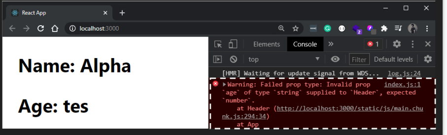
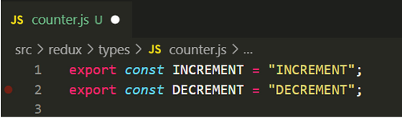
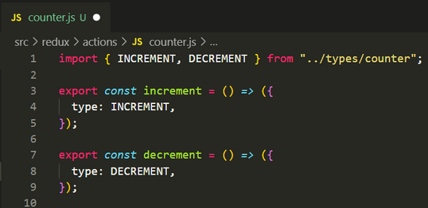
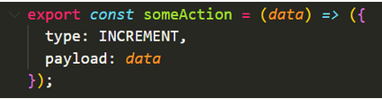
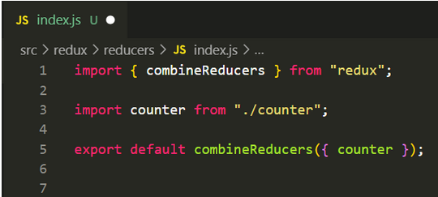

# MINGGU Ke-7

## REACT JS

### Proptypes
Prop Types merupakan sebuah lib yang dapat emmbantu untuk memeriksa data props yang dikirim agar sesuai dengan ekspektasi. Jika tidak sesuai, maka akan muncul pesan error
- Install PropTypes
  
        npm install prop-types
- Contoh penggunaan PropTypes
  
        import PropTypes from 'prop-types';

        function Header(props){
            return(
                <>
                    <h2>Name: {props.char}</h2>
                    <h2>Age: {props.age}</h2>
                </>
            )
        }

        Header.propTypes = {
            char: PropTypes.string,
            age: PropTypes.number
        }

    Props yang akan dikirim harus sesuai dengan tipe data yang diinginkan.
    Kode sperti contoh akan mendapatkan pesan error jika tidak sesuai dengan ekspektasi, seperti berikut<br/>
    

### React Router
React Router adalah sistem perpustakaan standar yang dibangun di atas React dan digunakan untuk membuat perutean di aplikasi React menggunakan Paket React Router. <br/>
React Router memainkan peran penting untuk menampilkan banyak tampilan dalam satu aplikasi halaman. Tanpa React Router, tidak mungkin menampilkan banyak tampilan di aplikasi React. Sebagian besar situs media sosial seperti Facebook, Instagram menggunakan React Router untuk menampilkan banyak tampilan.
- Instalasi React Router
  React berisi tiga paket berbeda untuk perutean:
  1. react-router: Ini menyediakan komponen dan fungsi perutean inti untuk aplikasi React Router.
  2. react-router-native: Ini digunakan untuk aplikasi seluler.
  3. react-router-dom: Digunakan untuk desain aplikasi web.

        
        npm install react-router-dom -save
    
    Ada dua jenis komponen router:
    1. ```<BrowserRouter>```: Ini digunakan untuk menangani URL dinamis.
    2. ```<HashRouter>```: Ini digunakan untuk menangani permintaan statis.

- Configuring The Router
  
        import React from "react"
        import ReactDOM from "react-dom/client"
        import App from "./App"
        import { BrowserRouter } from "react-router-dom"

        const root = ReactDOM.createRoot(document.getElementById("root"))
        root.render(
        <React.StrictMode>
            <BrowserRouter>
            <App />
            </BrowserRouter>
        </React.StrictMode>
        )

- Defining Routes
  
        import { Route, Routes } from "react-router-dom"
        import { Home } from "./Home"
        import { BookList } from "./BookList"

        export function App() {
            return (
                <Routes>
                <Route path="/" element={<Home />} />
                <Route path="/books" element={<BookList />} />
                </Routes>
            )
        }

- Handling Navigation 
  
        import { Route, Routes, Link } from "react-router-dom"
        import { Home } from "./Home"
        import { BookList } from "./BookList"

        export function App() {
        return (
            <>
            <nav>
                <ul>
                <li><Link to="/">Home</Link></li>
                <li><Link to="/books">Books</Link></li>
                </ul>
            </nav>

            <Routes>
                <Route path="/" element={<Home />} />
                <Route path="/books" element={<BookList />} />
            </Routes>
            </>
        )
        }

- Routing Priority
  
        <Routes>
            <Route path="/" element={<Home />} />
            <Route path="/books" element={<BookList />} />
            <Route path="/books/:id" element={<Book />} />
            <Route path="/books/new" element={<NewBook />} />
            <Route path="*" element={<NotFound />} />
        </Routes>
    
    - Nested Routes
      
            <Routes>
                <Route path="/" element={<Home />} />
                    <Route path="/books">
                        <Route index element={<BookList />} />
                        <Route path=":id" element={<Book />} />
                        <Route path="new" element={<NewBook />} />
                    </Route>
                <Route path="*" element={<NotFound />} />
            </Routes>
    
    - Shared Layout
      
            <Routes>
                <Route path="/" element={<Home />} />
                    <Route path="/books" element={<BooksLayout />}>
                        <Route index element={<BookList />} />
                        <Route path=":id" element={<Book />} />
                        <Route path="new" element={<NewBook />} />
                    </Route>
                <Route path="*" element={<NotFound />} />
            </Routes>

### React Redux
Redux adalah salah satu state management yang sangat hype pada waktunya dan masih relevan sampai sekarang.
- Setup Redux
  
        npm install redux react-redux
    
    Setelah install, siapkan flder redux di dalam src/<br/>
    
- File Store<br/>
  Buat file store.js pada folder redux [/src/redux/store.js] dan sematkan kode berikut:<br/>
  
- Types<br/>
  Ada yang menyebut sebagai constants atau types dimana kita mendeklarasi setiap kegiatan yang akan terjadi pada reducer counter agar tidak ada salah sebut nama variable ketika digunakan. Maka sebaiknya kita buat 1 folder types pada redux [/src/redux/types] dan sebuah file baru dengan nama counter.js dengan kode berikut:<br/>
  
- Actions<br/>
  Pada folder ini kita harus setuju bahwa semua action atau kegiatan atau juga bisa disebut kejadian akan kita letakkan pada folder ini.<br/>
  Buat folder baru actions di dalam folder redux [/src/redux/actions/] dan buat sebuah file dengan nama counter.js
  
  - Pada baris pertama kita import semua kegiatan yang kita miliki pada tipe kegiatan yang akan terjadi pada reducer counter
  - Pada baris 3-5 adalah sebuah arrow function dengan nama increment yang hanya mengirim sebuah object (dispatch) ke reducer kita dengan isian object seperti tertera pada line 4.

  Jika action kita cukup kompleks dan memiliki data yang akan dikirim, kita bisa sematkan sebagai kode snippet berikut:<br/>
  
  - Pada baris 7-9 sama dengan baris function sebelumnya hanya beda kegiatan.

- Reducer<br/>
  Pada folder ini dimana semua states kita tinggal, kita perlu membuat folder reducer [/src/redux/reducers/] dan file pertama yaitu index.js yang akan kita gunakan untuk indexing setiap reducer kita dan menggabungkan semua state yang kita miliki.<br/>
  
  - Line pertama kita import combineReducers sebuah function dari package redux untuk menggabungkan object-object state yang kita miliki.
  - Line 3 kita import counter dari file counter.js
  - Line 5 kita export secara default object yang sudah digabung menggunakan combineReducers.

### Redux Thunk
Redux Thunk adalah middleware yang memungkinkan Anda memanggil pembuat aksi yang mengembalikan fungsi sebagai ganti objek aksi. Fungsi itu menerima metode pengiriman penyimpanan, yang kemudian digunakan untuk mengirim aksi sinkron di dalam isi fungsi setelah operasi asinkron selesai.
- Installasi redux-thunk
  
        npm install redux-thunk
- Contoh penerapan
  
        import React from 'react';
        import ReactDOM from 'react-dom';
        import { Provider } from 'react-redux';
        import { createStore, applyMiddleware } from 'redux';
        import thunk from 'redux-thunk';
        import './index.css';
        import rootReducer from './reducers';
        import App from './App';
        import * as serviceWorker from './serviceWorker';

        // use applyMiddleware to add the thunk middleware to the store
        const store = createStore(rootReducer, applyMiddleware(thunk));

        ReactDOM.render(
        <Provider store={store}>
            <App />
        </Provider>,
        document.getElementById('root')
        );
